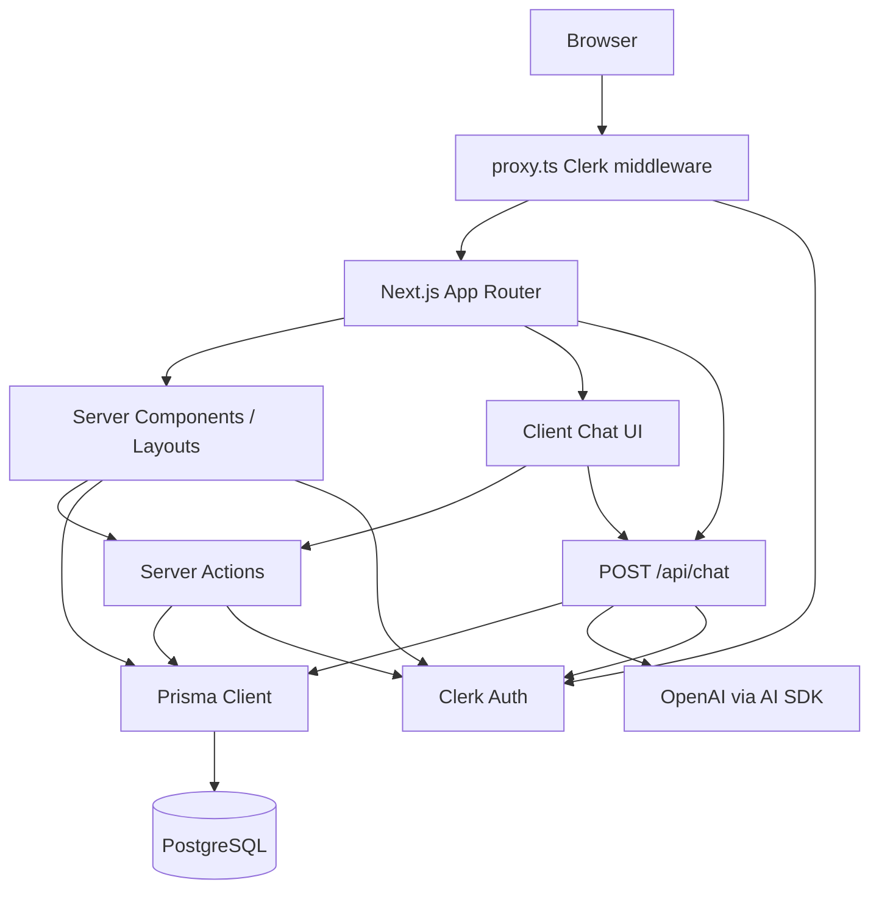
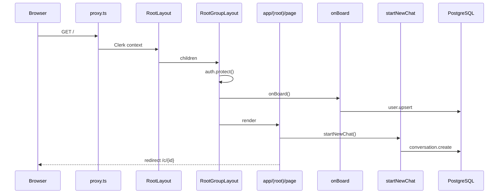
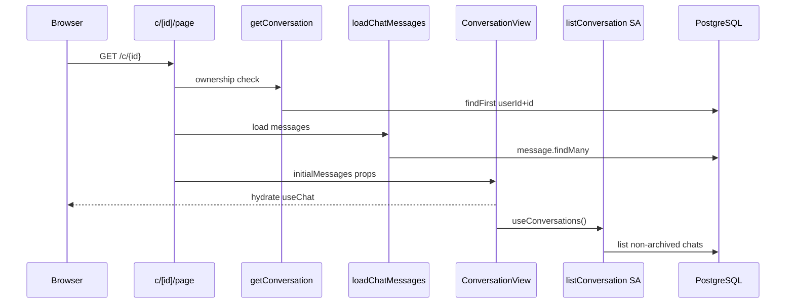
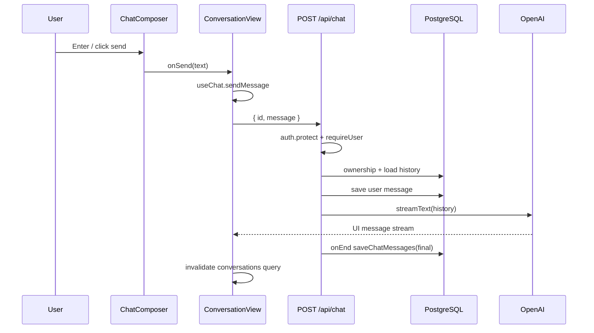
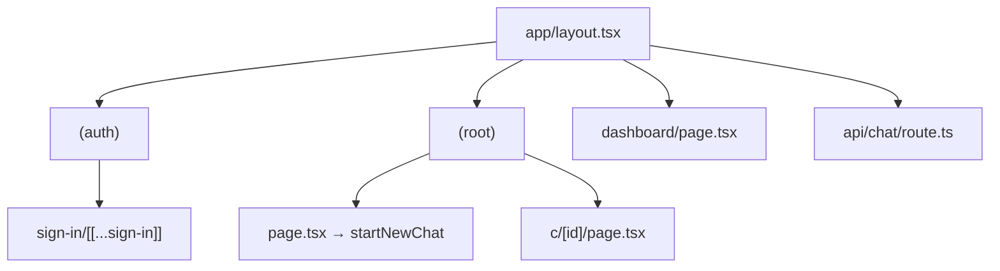
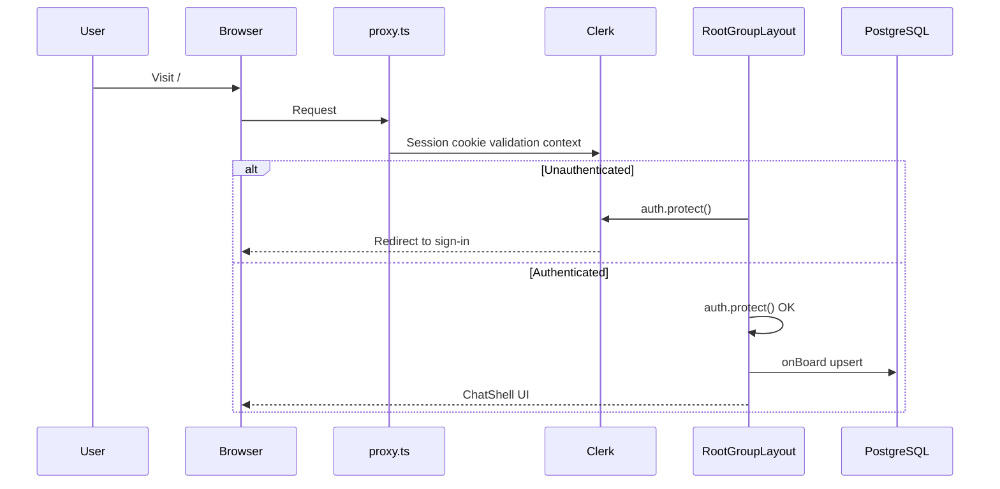
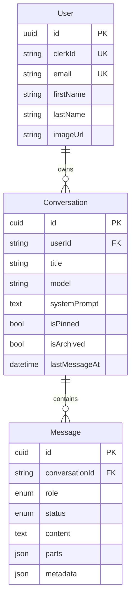

# ChaiGPT — Complete Developer Documentation

> **Documentation snapshot:** This handbook documents the repository as of **2026-07-18** (uncommitted App Router chat application). It is intentionally production-oriented and code-backed. Secret values are never recorded — only environment variable **names**.

---

## Table of Contents

1. [Project Overview](#1-project-overview)
2. [Folder Structure](#2-folder-structure)
3. [Application Flow](#3-application-flow)
4. [Routing](#4-routing)
5. [React Components](#5-react-components)
6. [Server Components vs Client Components](#6-server-components-vs-client-components)
7. [Server Actions](#7-server-actions)
8. [Authentication](#8-authentication)
9. [Database Layer](#9-database-layer)
10. [API Integrations](#10-api-integrations)
11. [State Management](#11-state-management)
12. [Data Fetching](#12-data-fetching)
13. [Error Handling](#13-error-handling)
14. [Security](#14-security)
15. [Performance](#15-performance)
16. [Important Design Patterns](#16-important-design-patterns)
17. [Request Lifecycle](#17-request-lifecycle)
18. [File Dependency Graph](#18-file-dependency-graph)
19. [Common Developer Mistakes](#19-common-developer-mistakes)
20. [Learning Guide](#20-learning-guide)

---

## 1. Project Overview

### What problem does this project solve?

**ChaiGPT** is a multi-conversation AI chat product. Authenticated users can:

- Sign in with Clerk
- Create / list / rename / pin / delete chats
- Send messages and receive **streaming** OpenAI assistant replies
- Persist conversation history in PostgreSQL via Prisma

It is a ChatGPT-style web app focused on a single-user conversation workspace (sidebar + chat pane), not a multi-tenant SaaS dashboard.

### High-level architecture



**Architectural style:** Feature-oriented modular monolith on Next.js App Router.

| Layer | Responsibility |
| --- | --- |
| `app/` | Routes, layouts, API handlers |
| `features/` | Domain logic (auth, conversation, messages, AI, home) |
| `components/` | Shared providers + shadcn/Base UI primitives |
| `lib/` | Prisma client, utilities, generated Prisma client |
| `proxy.ts` | Clerk request middleware (Next.js 16 replacement for `middleware.ts`) |

### Main technologies used

| Technology | Version (package.json) | Role |
| --- | --- | --- |
| Next.js | 16.2.10 | App Router, RSC, Route Handlers, Server Actions |
| React | 19.2.4 | UI |
| TypeScript | ^5 | Types |
| Clerk | ^7.5.17 | Auth, sessions, `<SignIn>`, `<UserButton>` |
| Prisma | ^7.8.0 | ORM |
| PostgreSQL + `pg` | adapter-pg / pg ^8.22 | Database |
| Vercel AI SDK (`ai`) | ^7.0.31 | Streaming chat, `UIMessage` |
| `@ai-sdk/openai` | ^4.0.16 | OpenAI provider |
| `@ai-sdk/react` | ^4.0.34 | `useChat` |
| TanStack Query | ^5.101.2 | Client server-state cache (sidebar) |
| Tailwind CSS | ^4 | Styling |
| shadcn / Base UI | base-nova style | Component system |
| next-themes | ^0.4.6 | Dark/light mode |
| Sonner | ^2.0.7 | Toasts |
| Zod | ^4.4.3 | Installed but **unused** at runtime |

### Important dependencies (classification)

| Dependency | Status | Notes |
| --- | --- | --- |
| `next`, `react`, `react-dom` | Active | Core runtime |
| `@clerk/nextjs` | Active | Auth |
| `@prisma/client`, `@prisma/adapter-pg`, `pg`, `prisma` | Active | DB |
| `ai`, `@ai-sdk/openai`, `@ai-sdk/react` | Active | Chat streaming |
| `@tanstack/react-query` | Active | Conversation list / mutations |
| `next-themes`, `sonner`, `lucide-react` | Active | Theme, toasts, icons |
| `@base-ui/react`, `class-variance-authority`, `clsx`, `tailwind-merge` | Active | UI system |
| `cmdk`, `embla-carousel-react`, `input-otp`, `react-day-picker`, `react-resizable-panels`, `recharts`, `date-fns` | Mostly dormant | Pulled in by generated UI primitives not used by product screens |
| `zod` | Installed, unused | Intended for validation; no schemas yet |
| `shadcn` | Tooling/runtime dep | CLI-related package present in dependencies |

### Environment variables (names only)

| Variable | Consumer | Purpose |
| --- | --- | --- |
| `DATABASE_URL` | `lib/db.ts`, `prisma.config.ts` | PostgreSQL connection string |
| `DATABASE_CA_CERT` | `lib/db.ts` | Optional TLS CA PEM |
| `DATABASE_SSL_REJECT_UNAUTHORIZED` | `lib/db.ts` | Set `"false"` to relax TLS verification |
| `OPENAI_API_KEY` | `app/api/chat/route.ts` (+ AI SDK provider) | OpenAI access |
| `NODE_ENV` | `lib/db.ts` | Dev singleton Prisma client |
| Clerk keys (`NEXT_PUBLIC_CLERK_*`, `CLERK_SECRET_KEY`, etc.) | Clerk SDK (convention) | Auth; referenced by Clerk, not hard-coded in app source |

---

## 2. Folder Structure

### Top-level layout

```text
chai-gpt-build/
├── app/                    # App Router routes & layouts
├── components/
│   ├── providers/          # Query + Theme providers
│   └── ui/                 # shadcn / Base UI primitives (60 files)
├── features/               # Domain modules
│   ├── ai/
│   ├── auth/
│   ├── conversation/
│   ├── home/
│   └── messages/
├── hooks/                  # Shared hooks (useIsMobile)
├── lib/                    # db, utils, generated Prisma
├── prisma/                 # schema.prisma
├── public/                 # static SVG assets
├── proxy.ts                # Clerk middleware (Next 16)
├── next.config.ts
├── prisma.config.ts
├── components.json         # shadcn config
├── package.json / bun.lock
├── AGENTS.md / CLAUDE.md   # agent rules (point at Next 16 docs)
└── README.md               # create-next-app starter (stale)
```

**Runtime legend used below**

| Runtime | Meaning |
| --- | --- |
| **Server** | RSC / Server Action / Route Handler / Node-only module |
| **Client** | `"use client"` module; hydrates in browser |
| **Both** | Shared pure module safe on either side |
| **Framework** | Invoked by Next.js; not imported by app code |

**Status legend**

| Status | Meaning |
| --- | --- |
| Active | On a live product path |
| Transitive | Used only via another active file |
| Dormant | Present but not imported by product screens |
| Generated | Build/tool output |

---

### 2.1 `app/` — routing surface

#### `app/layout.tsx` — Root layout

| Field | Detail |
| --- | --- |
| Why | Required App Router root; owns `<html>` / `<body>` |
| Responsibility | Fonts, global CSS, Clerk / Query / Theme providers, metadata |
| Imports | `next/font/google`, `./globals.css`, `@/lib/utils`, ThemeProvider, ClerkProvider, QueryProvider |
| Imported by | Framework |
| Runtime | Server (wraps client providers) |
| Status | Active |

#### `app/globals.css`

| Field | Detail |
| --- | --- |
| Why | Design tokens, Tailwind 4 + shadcn theme, light/dark OKLCH palette |
| Responsibility | Global styles |
| Imports | Tailwind / tw-animate / shadcn CSS entrypoints |
| Imported by | `app/layout.tsx` |
| Runtime | Build-time CSS |
| Status | Active |

#### `app/(root)/layout.tsx` — Protected chat shell layout

| Field | Detail |
| --- | --- |
| Why | Gate `/` and `/c/[id]` behind auth + onboarding |
| Responsibility | `auth.protect()`, `onBoard()`, render `ChatShell` + `Toaster` |
| Imports | `@clerk/nextjs/server`, `onBoard`, `ChatShell`, `Toaster` |
| Imported by | Framework |
| Runtime | Server |
| Status | Active |

#### `app/(root)/page.tsx` — Home (`/`)

| Field | Detail |
| --- | --- |
| Why | “New chat” entry: create conversation then redirect |
| Responsibility | Call `startNewChat()`, `redirect(/c/{id})` |
| Imports | `startNewChat`, `next/navigation` |
| Imported by | Framework |
| Runtime | Server |
| Status | Active — **mutates DB on GET/render** (production risk) |

#### `app/(root)/c/[id]/page.tsx` — Conversation (`/c/:id`)

| Field | Detail |
| --- | --- |
| Why | Load one owned conversation + messages into chat UI |
| Responsibility | Await `params`, ownership check, load messages, render `ConversationView` |
| Imports | `loadChatMessages`, `getConversation`, `ConversationView`, `notFound` |
| Imported by | Framework |
| Runtime | Server |
| Status | Active |

#### `app/(auth)/sign-in/layout.tsx`

| Field | Detail |
| --- | --- |
| Why | Centered auth chrome |
| Responsibility | Flex-centered container for Clerk UI |
| Imports | React |
| Imported by | Framework |
| Runtime | Server |
| Status | Active |

#### `app/(auth)/sign-in/[[...sign-in]]/page.tsx`

| Field | Detail |
| --- | --- |
| Why | Clerk sign-in (optional catch-all) |
| Responsibility | Render `<SignIn forceRedirectUrl="/" />` |
| Imports | `@clerk/nextjs` |
| Imported by | Framework |
| Runtime | Server (renders Clerk client component) |
| Status | Active |

#### `app/dashboard/page.tsx`

| Field | Detail |
| --- | --- |
| Why | Placeholder dashboard |
| Responsibility | Link home + heading |
| Imports | `next/link` |
| Imported by | Framework |
| Runtime | Client |
| Status | Active route but **outside protected `(root)` group** |

#### `app/api/chat/route.ts`

| Field | Detail |
| --- | --- |
| Why | Streaming AI endpoint |
| Responsibility | Auth, ownership, persist user message, stream OpenAI, persist finals |
| Imports | chat-store, model util, requireUser, prisma, Clerk auth, AI SDK |
| Imported by | Framework (HTTP) |
| Runtime | Server (Node) |
| Status | Active |

**Missing App Router conventions (intentional gaps today):** no `loading.tsx`, `error.tsx`, `global-error.tsx`, `template.tsx`, `not-found.tsx`, `default.tsx`, `forbidden.tsx`, `unauthorized.tsx`.

---

### 2.2 `features/` — domain modules

#### Auth

| File | Why / responsibility | Imports | Imported by | Runtime | Status |
| --- | --- | --- | --- | --- | --- |
| `features/auth/action/onboard.ts` | Upsert Clerk user → Prisma `User` | prisma, Clerk `currentUser` | `(root)/layout.tsx` | Server Action | Active |
| `features/auth/action/require-user.ts` | Protect + resolve DB user | prisma, Clerk `auth` | conversation/message/home actions, `/api/chat` | Server Action | Active |

#### Home

| File | Why / responsibility | Imports | Imported by | Runtime | Status |
| --- | --- | --- | --- | --- | --- |
| `features/home/actions/start-new-chat.ts` | Create empty conversation | requireUser, prisma | `(root)/page.tsx` | Server Action | Active |

#### Conversation

| File | Why / responsibility | Imports | Imported by | Runtime | Status |
| --- | --- | --- | --- | --- | --- |
| `features/conversation/action/conversation-action.ts` | CRUD + ownership for conversations | requireUser, prisma, revalidatePath | page + hooks | Server Action | Active |
| `features/conversation/hooks/use-conversation.ts` | TanStack Query façade | actions, queryKeys, router, toast | AppSidebar, ConversationView | Client | Active |
| `features/conversation/utils/query-keys.ts` | Cache key factory | — | hooks (conversation + messages) | Both | Active |
| `features/conversation/component/chat-shell.tsx` | Sidebar + inset shell | sidebar UI, AppSidebar | `(root)/layout.tsx` | Client | Active |
| `features/conversation/component/app-sidebar.tsx` | Chat list, rename/pin/delete, theme, UserButton | hooks, sidebar/dropdown/button/skeleton, Clerk, next-themes | ChatShell | Client | Active |
| `features/conversation/component/conversation-view.tsx` | Chat controller (`useChat`) | AI SDK, Query, ChatEmpty/Messages/Composer | `/c/[id]/page.tsx` | Client | Active |
| `features/conversation/component/chat-message.tsx` | Render + auto-scroll messages | message/bubble/spinner UI | ConversationView | Client | Active |
| `features/conversation/component/chat-composer.tsx` | Controlled send form | input-group, spinner | ConversationView | Client | Active |
| `features/conversation/component/chat-empty.tsx` | Empty thread placeholder | empty UI | ConversationView | Both* | Active |

\* `chat-empty.tsx` has no `"use client"` but is imported into a Client Component tree.

#### AI

| File | Why / responsibility | Imports | Imported by | Runtime | Status |
| --- | --- | --- | --- | --- | --- |
| `features/ai/action/chat-store.ts` | Load/save `UIMessage` ↔ Prisma | ai, prisma | `/c/[id]` page, `/api/chat` | Server Action module | Active — **auth gap** (see §7/§14) |
| `features/ai/utils/model.ts` | OpenAI model factory | `@ai-sdk/openai` | `/api/chat` | Server | Active |

#### Messages (parallel / dormant path)

| File | Why / responsibility | Imports | Imported by | Runtime | Status |
| --- | --- | --- | --- | --- | --- |
| `features/messages/actions/messages-action.ts` | Message CRUD with ownership | requireUser, prisma, revalidatePath | use-messages only | Server Action | Dormant (no UI caller) |
| `features/messages/hooks/use-messages.ts` | Query/mutations for messages | actions, queryKeys, toast | **none** | Client | Dormant |

---

### 2.3 `components/`

#### Providers

| File | Why | Imports | Imported by | Runtime | Status |
| --- | --- | --- | --- | --- | --- |
| `components/providers/query-provider.tsx` | One QueryClient per mount; 30s staleTime | `@tanstack/react-query` | `app/layout.tsx` | Client | Active |
| `components/providers/theme-provider.tsx` | next-themes adapter | `next-themes` | `app/layout.tsx` | Client | Active |

#### UI primitives (`components/ui/*`)

All files exist for the shadcn **base-nova** kit. Product code only **directly** imports:

| Primitive | Used by |
| --- | --- |
| `sidebar.tsx` | ChatShell, AppSidebar, ConversationView |
| `dropdown-menu.tsx` | AppSidebar |
| `button.tsx` | AppSidebar (+ transitive via sidebar/input-group) |
| `skeleton.tsx` | AppSidebar, sidebar |
| `empty.tsx` | ChatEmpty |
| `message.tsx` | ChatMessages |
| `bubble.tsx` | ChatMessages |
| `spinner.tsx` | ChatMessages, ChatComposer |
| `input-group.tsx` | ChatComposer |
| `separator.tsx` | ConversationView |
| `sonner.tsx` | `(root)/layout.tsx` |

Transitive via those: `sheet`, `tooltip`, `input`, `textarea`, and `button` internals.

**Every UI file (exhaustive):**

| File | `"use client"` | Role | Product status |
| --- | --- | --- | --- |
| `accordion.tsx` | No | Accordion | Dormant |
| `alert.tsx` | No | Alert banner | Dormant |
| `alert-dialog.tsx` | Yes | Confirm dialog | Dormant |
| `aspect-ratio.tsx` | No | Aspect ratio box | Dormant |
| `attachment.tsx` | No | File attachment UI | Dormant |
| `avatar.tsx` | Yes | Avatar | Dormant |
| `badge.tsx` | No | Badge | Dormant |
| `breadcrumb.tsx` | No | Breadcrumbs | Dormant |
| `bubble.tsx` | No | Chat bubble | Active |
| `button.tsx` | No | Button (CVA) | Active |
| `button-group.tsx` | No | Button group | Dormant |
| `calendar.tsx` | Yes | Day picker | Dormant |
| `card.tsx` | No | Card layout | Dormant |
| `carousel.tsx` | Yes | Embla carousel | Dormant |
| `chart.tsx` | Yes | Recharts wrapper | Dormant |
| `checkbox.tsx` | Yes | Checkbox | Dormant |
| `collapsible.tsx` | Yes | Collapsible | Dormant |
| `combobox.tsx` | Yes | Combobox | Dormant |
| `command.tsx` | Yes | Command palette | Dormant |
| `context-menu.tsx` | Yes | Context menu | Dormant |
| `dialog.tsx` | Yes | Dialog | Dormant (transitive via command) |
| `direction.tsx` | Yes | RTL/LTR provider | Dormant |
| `drawer.tsx` | Yes | Drawer | Dormant |
| `dropdown-menu.tsx` | Yes | Menu | Active |
| `empty.tsx` | No | Empty state | Active |
| `field.tsx` | Yes | Form field system | Dormant |
| `hover-card.tsx` | Yes | Hover card | Dormant |
| `input.tsx` | No | Input | Transitive (sidebar) |
| `input-group.tsx` | Yes | Input + addons | Active |
| `input-otp.tsx` | Yes | OTP input | Dormant |
| `item.tsx` | No | List item | Dormant |
| `kbd.tsx` | No | Keyboard key | Dormant |
| `label.tsx` | Yes | Label | Dormant / transitive |
| `marker.tsx` | No | Marker row | Dormant |
| `menubar.tsx` | Yes | Menubar | Dormant |
| `message.tsx` | No | Message layout | Active |
| `message-scroller.tsx` | Yes | Optimized scroller | Dormant (not used; ChatMessages rolls its own) |
| `native-select.tsx` | No | Native select | Dormant |
| `navigation-menu.tsx` | No | Nav menu | Dormant |
| `pagination.tsx` | No | Pagination | Dormant |
| `popover.tsx` | Yes | Popover | Dormant |
| `progress.tsx` | Yes | Progress | Dormant |
| `radio-group.tsx` | Yes | Radio | Dormant |
| `resizable.tsx` | Yes | Resizable panels | Dormant |
| `scroll-area.tsx` | Yes | Scroll area | Dormant |
| `select.tsx` | Yes | Select | Dormant |
| `separator.tsx` | Yes | Separator | Active |
| `sheet.tsx` | Yes | Sheet | Transitive (sidebar mobile) |
| `sidebar.tsx` | Yes | Sidebar system | Active |
| `skeleton.tsx` | No | Skeleton | Active |
| `slider.tsx` | No | Slider | Dormant |
| `sonner.tsx` | Yes | Toaster | Active |
| `spinner.tsx` | No | Spinner | Active |
| `switch.tsx` | Yes | Switch | Dormant |
| `table.tsx` | Yes | Table | Dormant |
| `tabs.tsx` | Yes | Tabs | Dormant |
| `textarea.tsx` | No | Textarea | Transitive |
| `toggle.tsx` | Yes | Toggle | Dormant |
| `toggle-group.tsx` | Yes | Toggle group | Dormant |
| `tooltip.tsx` | Yes | Tooltip | Transitive (sidebar) |

Typical imports for UI files: `@/lib/utils` (`cn`), `@base-ui/react/*`, `class-variance-authority`, `lucide-react`, and sibling UI modules. Importers are either product features (active set) or other UI files (dormant graph).

---

### 2.4 `hooks/`, `lib/`, `prisma/`, root config, `public/`

| File | Why / responsibility | Imports | Imported by | Runtime | Status |
| --- | --- | --- | --- | --- | --- |
| `hooks/use-mobile.ts` | `matchMedia` mobile detection (768px) | React | `components/ui/sidebar.tsx` | Client-oriented (no directive; used from client) | Transitive |
| `lib/db.ts` | Prisma 7 + PrismaPg singleton | adapter-pg, generated client | All server data access | Server | Active |
| `lib/utils.ts` | `cn()` = clsx + twMerge | clsx, tailwind-merge | layouts + many UI/features | Both | Active |
| `lib/generated/prisma/*` | Prisma client output | generated | `lib/db.ts`, type imports | Generated / Server | Active (gitignored) |
| `prisma/schema.prisma` | Data model | — | Prisma CLI | Schema | Active |
| `prisma.config.ts` | Prisma 7 CLI config + dotenv | prisma/config | Prisma CLI | Tooling | Active |
| `proxy.ts` | Clerk middleware matcher | `@clerk/nextjs/server` | Framework | Server (Node) | Active |
| `next.config.ts` | `serverExternalPackages: ["pg"]` | next | Framework | Config | Active |
| `components.json` | shadcn aliases/style | — | shadcn CLI | Config | Active |
| `tsconfig.json` | Strict TS, `@/*` paths | — | tsc/Next | Config | Active |
| `package.json` / `bun.lock` | Deps + scripts | — | package manager | Config | Active |
| `eslint.config.mjs` | ESLint | — | lint | Config | Active |
| `postcss.config.mjs` | Tailwind PostCSS | — | build | Config | Active |
| `.gitignore` | Ignores `.env*`, `.next`, generated prisma | — | git | Config | Active |
| `AGENTS.md` / `CLAUDE.md` | Agent rules: read Next local docs | — | agents | Docs | Active for agents |
| `README.md` | Starter text (stale vs real app) | — | humans | Docs | Stale |
| `public/*.svg` | Default Next assets | — | none in app code | Static | Dormant |

---

## 3. Application Flow

### 3.1 Full product lifecycle (mental model)

```text
Browser
  ↓
proxy.ts (Clerk context)
  ↓
Root Layout (ClerkProvider → QueryProvider → ThemeProvider)
  ↓
Route group layout / page
  ↓
Server Action  OR  Route Handler  OR  RSC data load
  ↓
PostgreSQL / OpenAI / Clerk
  ↓
Response (HTML RSC payload, redirect, JSON/stream, or Server Action result)
  ↓
Client hydrate + React Query / useChat updates
```

### 3.2 Sequence: first authenticated visit to `/`



### 3.3 Sequence: load conversation `/c/{id}`



### 3.4 Sequence: send chat message (streaming)



### 3.5 Sequence: sidebar mutation (rename / pin / delete)

```text
Browser click
  ↓
ChatItem event handler
  ↓
useUpdateConversation / useDeleteConversation (TanStack Mutation)
  ↓
Server Action updateConversation / deleteConversation
  ↓
requireUser → assertOwnsConversation → Prisma mutate
  ↓
revalidatePath + React Query invalidate
  ↓
Sidebar re-renders; delete of active chat navigates to `/` (creates another chat)
```

---

## 4. Routing

### App Router structure

| URL | File | Group | Protected? |
| --- | --- | --- | --- |
| `/` | `app/(root)/page.tsx` | `(root)` | Yes (`auth.protect` in layout) |
| `/c/:id` | `app/(root)/c/[id]/page.tsx` | `(root)` | Yes |
| `/sign-in`, `/sign-in/*` | `app/(auth)/sign-in/[[...sign-in]]/page.tsx` | `(auth)` | Public (Clerk UI) |
| `/dashboard` | `app/dashboard/page.tsx` | none | **Not** protected by `(root)` layout |
| `POST /api/chat` | `app/api/chat/route.ts` | API | Protected inside handler |

Route groups `(root)` and `(auth)` **do not** appear in the URL.



### Dynamic routes

- `[id]` — conversation CUID.
- `[[...sign-in]]` — optional catch-all for Clerk’s multi-step sign-in paths.
- Next.js 16: `params` is a **`Promise`** — the conversation page correctly `await`s it.

### Layouts

| Layout | Scope | Notes |
| --- | --- | --- |
| `app/layout.tsx` | Entire app | Providers + fonts |
| `app/(root)/layout.tsx` | `/`, `/c/*` | Auth + onboarding + ChatShell |
| `app/(auth)/sign-in/layout.tsx` | Sign-in only | Centered card |

Layouts preserve state across child navigations (e.g., sidebar Query cache survives `/c/a` → `/c/b`).

### Templates / loading / error pages

| Convention | Present? | Effect |
| --- | --- | --- |
| `template.tsx` | No | No forced remount between navigations |
| `loading.tsx` | No | No Suspense fallback UI for slow auth/DB |
| `error.tsx` / `global-error.tsx` | No | Failures use Next default error UI |
| `not-found.tsx` | No | `notFound()` shows framework default 404 |

### Middleware / Proxy

Next.js 16 uses **`proxy.ts`** (not `middleware.ts`).

```ts
// proxy.ts
export default clerkMiddleware()
```

Matcher covers dynamic pages, `/api/*`, `/trpc/*`, `/__clerk/*`, skipping static assets.

**Critical:** `clerkMiddleware()` alone installs Clerk request context; it does **not** globally call `auth.protect()`. Protection is applied in `(root)` layout and `/api/chat`.

---

## 5. React Components

### Hierarchy

```text
RootLayout [Server]
└─ ClerkProvider
   └─ QueryProvider [Client]
      └─ ThemeProvider [Client]
         ├─ AuthLayout → SignIn
         ├─ Dashboard [Client]
         └─ RootGroupLayout [Server]
            └─ ChatShell [Client]
               ├─ AppSidebar
               │  ├─ ChatList → ChatItem*
               │  └─ SidebarFooterMenu
               └─ SidebarInset
                  ├─ ConversationView | (home redirect only)
                  └─ Toaster
```

### Important application components

#### `ChatShell`

| Field | Detail |
| --- | --- |
| Purpose | Application chrome: sidebar + main inset |
| Parent | `(root)/layout.tsx` |
| Children | `SidebarProvider`, `AppSidebar`, `SidebarInset` → `{children}` |
| Props | `children` |
| State | None local; sidebar context from `SidebarProvider` |
| Hooks | None |
| Why | Shared shell for all protected chat routes |

#### `AppSidebar` (+ `ChatList`, `ChatItem`, `SidebarFooterMenu`)

| Field | Detail |
| --- | --- |
| Purpose | Navigation, chat CRUD UI, theme toggle, account |
| Parent | `ChatShell` |
| Children | Sidebar primitives, list rows, dropdowns, `UserButton` |
| Props | None (reads pathname + queries) |
| State | `mounted` (footer hydration guard); mutations via TanStack |
| Hooks | `usePathname`, `useConversations`, per-row update/delete, `useTheme`, `useEffect` |
| Why | Primary conversation management surface |

#### `ConversationView`

| Field | Detail |
| --- | --- |
| Purpose | Own AI chat session for one conversation |
| Parent | `/c/[id]/page.tsx` |
| Children | Header, `ChatEmpty` or `ChatMessages`, `ChatComposer` |
| Props | `conversationId`, `initialMessages: UIMessage[]` |
| State | AI SDK messages/status via `useChat` |
| Hooks | `useQueryClient`, `useConversations`, `useMemo` (transport), `useChat` |
| Why | Bridge SSR history → streaming client |

#### `ChatMessages`

| Field | Detail |
| --- | --- |
| Purpose | Render bubbles + stick-to-bottom scroll |
| Parent | `ConversationView` |
| Children | `Message` / `Bubble` / `Spinner` |
| Props | `messages`, `status` |
| State | refs for scroll stickiness |
| Hooks | `useRef`, `useEffect` |
| Why | Readable streaming transcript |

#### `ChatComposer`

| Field | Detail |
| --- | --- |
| Purpose | Controlled textarea + send |
| Parent | `ConversationView` |
| Children | `InputGroup*` |
| Props | `onSend`, `isSending?`, `placeholder?`, `className?`, `autoFocus?` |
| State | `value` string |
| Hooks | `useState`, `useRef`, `useEffect` |
| Why | User input surface; Enter sends, Shift+Enter newline |

#### `ChatEmpty`

| Field | Detail |
| --- | --- |
| Purpose | Empty-thread marketing copy |
| Parent | `ConversationView` |
| Children | `Empty*` primitives |
| Props | None |
| State / hooks | None |
| Why | First-paint empty UX |

#### Providers / dashboard / auth page

| Component | Purpose | Parent | Notable props/state |
| --- | --- | --- | --- |
| `QueryProvider` | TanStack context | RootLayout | lazy `QueryClient` |
| `ThemeProvider` | Theme class on `<html>` | RootLayout | next-themes props |
| `Dashboard` | Placeholder | Framework | Link only |
| Sign-in `Page` | Clerk UI | AuthLayout | `forceRedirectUrl="/"` |

---

## 6. Server Components vs Client Components

### Rule of thumb in this codebase

- **Server by default** for routes/layouts that need secrets, Clerk server APIs, Prisma, redirects, `notFound`.
- **Client** when the file needs browser APIs, event handlers, streaming UI state, React Query, or theme toggling.

### Classification table (application-owned)

| Unit | Type | Why |
| --- | --- | --- |
| `app/layout.tsx` | Server | Document shell; can nest client providers |
| `app/(root)/layout.tsx` | Server | `auth.protect` + DB onboarding |
| `app/(root)/page.tsx` | Server | Mutation + redirect |
| `app/(root)/c/[id]/page.tsx` | Server | Ownership + message load |
| Auth layout + sign-in page | Server | Static structure / RSC that renders Clerk |
| `app/dashboard/page.tsx` | Client | Explicit `"use client"` (could be Server) |
| `ChatShell`, `AppSidebar`, `ConversationView`, `ChatMessages`, `ChatComposer` | Client | Interactivity / streaming / Query |
| `ChatEmpty` | Server-capable, used under Client | Presentational |
| All `features/**/action*`, `chat-store` | Server Actions / server modules | DB + auth |
| Hooks under `features/**/hooks` | Client | TanStack + router |
| UI overlays/controls with `"use client"` | Client | Base UI evented widgets |
| Presentational UI without directive | Server-capable | Often pulled into client graphs |

### Interleaving pattern used

`(root)/layout` (Server) → `ChatShell` (Client) → `{children}` still may be Server Component output (`ConversationView` is Client, but the page that renders it is Server). This is the supported RSC composition model: pass serializable props (`UIMessage[]`) across the boundary.

---

## 7. Server Actions

> **Extremely detailed.** Every `"use server"` export is documented. In Next.js, exports from `"use server"` files are callable as RPC endpoints — treat them as public API surface even if current callers are server-only.

### Browser → Server Action execution flow

```text
User event (click / navigation render)
  ↓
Client import of async server function  OR  Server Component await
  ↓
Next.js POST to current route (Server Action protocol)
  ↓
Server Action body runs on Node
  ↓
auth / validation / Prisma
  ↓
Serialized return value OR thrown Error
  ↓
Client mutation onSuccess / RSC re-render / redirect
```

---

### 7.1 `onBoard()` — `features/auth/action/onboard.ts`

| Aspect | Detail |
| --- | --- |
| Who calls | `app/(root)/layout.tsx` |
| When | Every protected layout render |
| Arguments | None |
| Validation | Throws if `currentUser()` is null |
| Business logic | Map Clerk profile → local `User` |
| Database | `user.upsert` on `clerkId` |
| Return | Full Prisma `User` |
| Errors | Unauth; empty `emailAddresses[0]` access risk; unique email conflicts |
| Cache | None |

**Note:** Uses first email address, not necessarily Clerk primary email. Upserts on every navigation → updates `updatedAt` frequently.

---

### 7.2 `requireUser()` — `features/auth/action/require-user.ts`

| Aspect | Detail |
| --- | --- |
| Who calls | conversation/message/home actions, `/api/chat` |
| When | Before any owned data access |
| Arguments | None |
| Validation | `auth.protect()`; DB user must exist |
| Business logic | Resolve Clerk ID → Prisma user |
| Database | `user.findUnique({ clerkId })` |
| Return | Prisma `User` |
| Errors | `"User not found. Complete onboarding first."` if layout onboarding raced / failed |
| Cache | None |

---

### 7.3 `startNewChat()` — `features/home/actions/start-new-chat.ts`

| Aspect | Detail |
| --- | --- |
| Who calls | `app/(root)/page.tsx` |
| When | Rendering `/` |
| Arguments | None |
| Validation | Via `requireUser` |
| Business logic | Create conversation titled `"New Chat"` |
| Database | `conversation.create` |
| Return | `conversation.id` (string) |
| Errors | Auth / missing user / DB insert |
| Cache | No invalidation (sidebar refreshes via Query later) |

---

### 7.4 Conversation actions — `features/conversation/action/conversation-action.ts`

#### Internal: `assertOwnsConversation(conversationId, userId)`

Private helper. `findFirst` by id+userId; throws `"Conversation not found"` (hides ownership).

#### `getConversation(conversationId)`

| Aspect | Detail |
| --- | --- |
| Who | `/c/[id]/page.tsx` |
| When | Before loading messages |
| Args | `conversationId: string` |
| Validation | Auth + ownership |
| DB | Owned `findFirst` (full row) |
| Return | Conversation |
| Errors | Throw → page catches → `notFound()` |

#### `listConversation()`

| Aspect | Detail |
| --- | --- |
| Who | `useConversations` |
| When | Sidebar / title fetch after hydrate |
| Args | None |
| DB | `findMany` where `userId` + `isArchived:false`, order pinned then `lastMessageAt` |
| Return | `ConversationListItem[]` |

#### `createConversation(title = "New Chat")`

| Aspect | Detail |
| --- | --- |
| Who | `useCreateConversation` (**no component currently calls this hook**) |
| Args | optional title |
| DB | create with trimmed title |
| Return | Conversation |

#### `updateConversation(id, data)`

| Aspect | Detail |
| --- | --- |
| Who | Sidebar rename/pin |
| Args | `{ title?, isPinned?, isArchived? }` |
| Validation | Ownership; empty title → `"New Chat"` |
| DB | check then `update` (non-transactional) |
| Cache | `revalidatePath("/")`, `revalidatePath(/c/id)` + Query invalidation in hook |
| Return | Updated conversation |

#### `deleteConversation(id)`

| Aspect | Detail |
| --- | --- |
| Who | Sidebar delete |
| DB | Ownership then `delete` (messages cascade via schema) |
| Cache | `revalidatePath("/")` + Query invalidate; removes message query key |
| Return | `{ id }` |
| Side effect | If active, hook routes to `/` → **creates another chat** |

---

### 7.5 Message actions — `features/messages/actions/messages-action.ts` (dormant UI)

| Action | Args | Validation | DB | Return | Notes |
| --- | --- | --- | --- | --- | --- |
| `listMessages(conversationId)` | id | ownership | messages asc | `MessageItem[]` | No `parts` in select |
| `createMessage(conversationId, content)` | id, text | non-empty trim | create USER + update conversation title/time | message | Separate from AI stream path |
| `updateMessage(messageId, content)` | id, text | ownership via include conversation | updates **content only** | message | **Does not update `parts`** → stale AI parts |
| `deleteMessage(messageId)` | id | ownership | delete | `{ id, conversationId }` | Does not recompute `lastMessageAt` |

Hooks in `use-messages.ts` wrap these but are **not imported by any component**. Live chat uses `/api/chat` + `chat-store` instead.

---

### 7.6 Chat store — `features/ai/action/chat-store.ts`

#### `loadChatMessages(conversationId)`

| Aspect | Detail |
| --- | --- |
| Who | `/c/[id]/page`, `/api/chat` |
| Auth | **None inside function** |
| DB | `message.findMany` ordered asc |
| Transform | Prefer JSON `parts`; ASSISTANT→assistant else user; skip empty content |
| Return | `UIMessage[]` |

#### `saveChatMessages(conversationId, messages, options?)`

| Aspect | Detail |
| --- | --- |
| Who | `/api/chat` (user message + onEnd) |
| Auth | **None inside function** |
| Args | conversationId, `UIMessage[]`, `{ updateTitle?: boolean }` |
| Logic | Skip system/empty; map assistant/other→USER; sequential `upsert` by **global message id**; update `lastMessageAt` + optional title from first user text (48 chars) |
| Return | `void` |
| Errors | Propagates Prisma errors to caller (API catches onEnd) |

**Critical risks**

1. Exported from `"use server"` without ownership checks.
2. Upsert `update` branch does not constrain `conversationId` → cross-conversation overwrite if message IDs collide/leak.
3. Whole history re-upserted on each turn → O(n²) DB work.
4. No transaction wrapping message upserts + conversation update.

---

## 8. Authentication

### Authentication flow



### Pieces

| Concern | Implementation |
| --- | --- |
| Identity provider | Clerk |
| Middleware | `proxy.ts` → `clerkMiddleware()` |
| Client provider | `ClerkProvider` in root layout |
| Sign-in UI | `/sign-in` → `<SignIn forceRedirectUrl="/" />` |
| Session / cookies / tokens | Managed by Clerk SDK (HttpOnly session cookies); app code does not manually parse JWTs |
| Authorization | Per-resource ownership via `userId` on conversations |
| Local user sync | `onBoard()` upsert; no Clerk webhooks |
| Roles / orgs | None |

### Authorization matrix

| Resource | Check |
| --- | --- |
| `/`, `/c/*` | Layout `auth.protect` + onboarding |
| Conversation CRUD | `requireUser` + `assertOwnsConversation` |
| `/api/chat` | `auth.protect` + `requireUser` + owned conversation |
| `loadChatMessages` / `saveChatMessages` | **Caller must enforce** (page/API do for load path; store itself does not) |
| `/dashboard` | None |

### Session handling notes

- Clerk handles refresh/rotation.
- App maps `clerkId` → UUID `User.id` for FK ownership.
- Race: page action calling `requireUser` before layout `onBoard` completes can throw “User not found”.

---

## 9. Database Layer

### ORM

- **Prisma 7** with **`@prisma/adapter-pg`** (driver adapter) — not the legacy Prisma binary engine path.
- Client generated to `lib/generated/prisma` (gitignored).
- Singleton in `lib/db.ts` with dev hot-reload reuse and SSL helpers.

### Models & relationships



Enums: `MessageRole` = USER | ASSISTANT | SYSTEM | TOOL; `MessageStatus` = PENDING | COMPLETED | ERROR.

Cascades: deleting User → Conversations → Messages; deleting Conversation → Messages.

### Indexes

- `Conversation`: `[userId, lastMessageAt DESC]`, `[userId, isPinned, lastMessageAt DESC]`
- `Message`: `[conversationId, createdAt DESC]`

Sidebar filters `isArchived:false` — a composite including `isArchived` may fit better later.

### Queries (representative)

| Operation | Location | Pattern |
| --- | --- | --- |
| Upsert user | onboard | upsert by clerkId |
| List chats | listConversation | findMany filtered/sorted |
| Own chat | assertOwns / API | findFirst id+userId |
| Load messages | loadChatMessages | findMany asc |
| Persist messages | saveChatMessages | sequential upsert by id |
| Title/time | save / createMessage | conversation.update |

### Transactions

**None** are used. Multi-step flows (message create + conversation update; multi-message upsert + title update) can partially succeed.

### Migrations

`prisma.config.ts` points at `prisma/migrations`, but **no migration directory/files** were present in the snapshot. Schema sync may be via `db push` or untracked history — treat deploy reproducibility as a risk.

---

## 10. API Integrations

### 10.1 Clerk

| Aspect | Detail |
| --- | --- |
| Why | Authentication, session, hosted sign-in, UserButton |
| Request flow | Browser cookies → `proxy.ts` → `auth()` / `currentUser()` / `auth.protect()` |
| Response flow | Redirects to sign-in or allows render; client components hydrate Clerk UI |
| Retry | SDK/default network behavior; app adds none |
| Errors | Unauth redirects; `onBoard` throws `"Unauthorised"` |

### 10.2 OpenAI (via Vercel AI SDK)

| Aspect | Detail |
| --- | --- |
| Why | Generate assistant replies |
| Entry | `POST /api/chat` → `streamText({ model: getChatModel(...), system, messages })` |
| Model | `conversation.model` or default `gpt-4o-mini` |
| Request flow | Convert `UIMessage[]` → model messages → OpenAI stream |
| Response flow | `toUIMessageStream` → `createUIMessageStreamResponse` → browser `useChat` |
| Persistence | `consumeStream()` keeps server work alive after client disconnect; `onEnd` saves |
| Retry | **None** |
| Error handling | Stream `onError` returns Error.message; outer catch returns 500 text; persistence errors logged only |
| Rate limit / cost control | **None** |

### 10.3 PostgreSQL

Accessed only through Prisma adapter. TLS optionally customized via `DATABASE_CA_CERT` / `DATABASE_SSL_REJECT_UNAUTHORIZED`.

---

## 11. State Management

There is **no Redux or Zustand**. Four systems coexist:

| System | Owner | What it stores |
| --- | --- | --- |
| AI SDK `useChat` | `ConversationView` | Live messages + stream status (**source of truth in chat UI**) |
| TanStack Query | Sidebar / title | Conversation list (+ unused message queries) |
| Local React state | Composer, sidebar mounted, sidebar open | Ephemeral UI |
| Database | Prisma | Durable users/chats/messages |

### TanStack Query

- Provider: one client, default `staleTime: 30_000`.
- No dehydration/hydration from RSC.
- No optimistic updates.
- Keys in `query-keys.ts`:

| Key | Value |
| --- | --- |
| List | `["conversation"]` |
| Detail | `["conversations", id]` (**singular/plural mismatch**) |
| Messages | `["messages", conversationId]` |

Detail key is invalidated by update hook but **no active detail query** uses it. Message keys are written by dormant hooks; delete-conversation still `removeQueries` on them.

### Context

- Clerk, Query, Theme at root.
- Sidebar context inside `SidebarProvider`.
- Primitive-local contexts (drawer/carousel/chart) unused by product screens.

### Cache strategy summary

| Layer | Strategy |
| --- | --- |
| React Query | 30s stale; invalidate on mutations / chat finish |
| Next `revalidatePath` | Used in conversation/message actions |
| Route cache | Effectively dynamic due to auth + DB |
| AI messages | Client memory seeded by SSR; DB on stream end |

---

## 12. Data Fetching

### Server-side fetching

- Layout: Clerk user + Prisma upsert (`onBoard`).
- `/c/[id]`: `getConversation` + `loadChatMessages` sequentially.
- Home: create conversation (mutation during render).

### Client-side fetching

- `useConversations` → Server Action `listConversation`.
- Chat turns → `POST /api/chat` (not a Server Action).
- Dormant: `useMessages` → `listMessages`.

### Revalidation / caching / Suspense / streaming

| Mechanism | Used? |
| --- | --- |
| `revalidatePath` | Yes (conversation/message actions) |
| `revalidateTag` / `unstable_cache` / `cache()` | No |
| React Query invalidation | Yes |
| `loading.tsx` Suspense boundaries | No |
| UI streaming (RSC) | Not customized |
| AI token streaming | Yes (HTTP UI message stream) |

**Waterfall:** Sidebar waits for client Query even though the server already hit the DB for auth/onboarding.

---

## 13. Error Handling

| Layer | Behavior |
| --- | --- |
| Global | No `error.tsx` / `global-error.tsx` → Next defaults |
| Route not found | `notFound()` on conversation ownership failure; **also swallows other getConversation errors as 404** |
| Validation | Minimal string checks; Zod unused |
| Server Actions | `throw new Error(message)` → client toast via mutation `onError` |
| API | 400 missing fields; 404 missing conversation; 500 missing key / provider errors (often raw message) |
| Stream errors | Toast via `useChat.onError` |
| Persistence after stream | `console.error` only — UI may show answer that vanishes on reload |
| Composer | Clears text before send; failure does not restore draft; `isSending={status !== "ready"}` can stick disabled on `"error"` |

---

## 14. Security

| Area | Current state |
| --- | --- |
| Authentication | Clerk sessions; protect on `(root)` + API |
| Authorization | Ownership checks on conversation CRUD; **gap on chat-store exports** |
| Input validation | Weak; no Zod schemas; unbounded titles/messages; client-controlled message role/id |
| XSS | Message text rendered as React text (`whitespace-pre-wrap`), not `dangerouslySetInnerHTML` |
| CSRF | Server Actions / same-site cookies rely on Next/Clerk defaults; no custom CSRF tokens |
| SQL injection | Prisma parameterized queries |
| Rate limiting | **None** on AI endpoint |
| Secrets | `.env*` gitignored; never commit keys |
| TLS | Optional `rejectUnauthorized: false` is an explicit footgun |
| Error leakage | Provider/DB messages may reach clients |
| `/dashboard` | Public (low sensitivity today) |
| IDOR / cross-conversation | Message upsert-by-id without conversation constraint |

**Production hardening priorities:** authorize chat-store, schema-validate `/api/chat`, rate-limit OpenAI calls, transactional saves, avoid render-time mutations.

---

## 15. Performance

| Topic | Current behavior | Implication |
| --- | --- | --- |
| Lazy loading | No `next/dynamic` on chat UI | Chat bundle loads with shell |
| Code splitting | Route-level automatic; large dormant UI should tree-shake if unused | Accidental barrel imports could bloat |
| Images | No `next/image` usage in product UI | N/A |
| Memoization | Transport `useMemo`; little message memoization | Full list re-renders per token |
| Virtualization | Not used; `message-scroller` unused | Long threads degrade |
| Persistence | Sequential upsert of **entire history** each turn | O(n²) DB round-trips |
| Auth work | protect + onboard upsert + requireUser repeats | Extra Clerk/DB latency per request |
| Fonts | `next/font` for Geist / Noto | Good |
| Sidebar Query | Post-hydration fetch | Skeleton flash |
| Prefetch | Links to `/` can amplify empty-chat creation | Cost + clutter |

### Next.js optimizations already in play

- App Router RSC for initial message payload.
- Streaming AI response (TTFB for tokens).
- `serverExternalPackages: ["pg"]` for native/pg compatibility.

---

## 16. Important Design Patterns

| Pattern | Where | Notes |
| --- | --- | --- |
| Feature modules | `features/*` | Vertical slices by domain |
| Server Actions as application service | `*/action*.ts` | Thin auth + Prisma; no separate service layer |
| Repository-ish helpers | `assertOwnsConversation`, `chat-store` | Not formal repositories |
| Singleton | `lib/db.ts` Prisma client | Dev globalThis cache |
| Factory | `getChatModel` | Provider model construction |
| Adapter | PrismaPg, AI SDK OpenAI provider, ThemeProvider | External systems adapted to app |
| Facade | `use-conversation` / `use-messages` hooks | Hide Server Actions behind Query |
| Composition | shadcn compound components | `Sidebar*`, `Message*`, `Empty*` |
| Optimistic UI | **Not used** | Mutations wait for server |
| Observer | React Query / AI SDK subscriptions | Cache & stream updates |
| Parallel dormant architecture | messages feature vs AI chat-store | Two persistence designs |

Patterns **not** present: DI container, formal CQRS, event bus, unit-of-work transactions.

---

## 17. Request Lifecycle

### Example A — User sends a chat message (happy path)

```text
1. User types in ChatComposer and presses Enter
2. React onKeyDown / form onSubmit → handleSubmit
3. Local state cleared; onSend(text) called
4. ConversationView → useChat.sendMessage({ text })
5. DefaultChatTransport prepareSendMessagesRequest builds body { id, message: last }
6. Browser POST /api/chat (cookies include Clerk session)
7. proxy.ts runs clerkMiddleware → auth context
8. Route: auth.protect()
9. JSON parse { message, id } (no Zod)
10. OPENAI_API_KEY presence check
11. requireUser() → auth.protect again + Prisma user lookup
12. prisma.conversation.findFirst({ id, userId })
13. loadChatMessages(id) → history
14. If new message id: saveChatMessages(id, [message]) with title update possible
15. streamText(model, systemPrompt, convertToModelMessages(messages))
16. result.consumeStream() keeps server alive
17. createUIMessageStreamResponse streams tokens to client
18. ChatMessages re-renders each update; auto-scroll if stuck to bottom
19. onEnd: saveChatMessages(id, finalMessages, { updateTitle: false })
20. useChat onFinish → invalidate ["conversation"] Query
21. Sidebar title/order refreshes
```

### Example B — Rename chat

```text
1. User opens row menu → Rename
2. window.prompt
3. useUpdateConversation.mutate
4. Server Action updateConversation
5. requireUser → assertOwns → update
6. revalidatePath + invalidateQueries
7. Sidebar shows new title; ConversationView header reads from Query list
```

### Example C — New chat via sidebar link

```text
1. Link href="/"
2. GET / through proxy + layouts
3. onBoard upsert
4. page startNewChat insert
5. redirect /c/{newId}
6. Conversation page loads empty messages → ChatEmpty
```

---

## 18. File Dependency Graph

### Active product spine

```text
proxy.ts
↓
app/layout.tsx
├─ components/providers/query-provider.tsx
├─ components/providers/theme-provider.tsx
↓
app/(root)/layout.tsx
├─ features/auth/action/onboard.ts → lib/db.ts → PostgreSQL
├─ features/conversation/component/chat-shell.tsx
│  └─ app-sidebar.tsx
│     └─ hooks/use-conversation.ts
│        └─ action/conversation-action.ts → require-user.ts → lib/db.ts
↓
app/(root)/page.tsx
└─ features/home/actions/start-new-chat.ts → require-user → db

app/(root)/c/[id]/page.tsx
├─ conversation-action.getConversation
├─ ai/action/chat-store.loadChatMessages
└─ conversation-view.tsx
   ├─ chat-empty / chat-message / chat-composer
   └─ POST app/api/chat/route.ts
      ├─ require-user
      ├─ chat-store load/save
      ├─ ai/utils/model.ts
      └─ OpenAI
```

### Dormant parallel graph

```text
features/messages/hooks/use-messages.ts
↓
features/messages/actions/messages-action.ts
↓
require-user → prisma
```

(No component imports the hooks.)

### UI dependency (active)

```text
conversation-view
├─ sidebar (trigger)
├─ separator
├─ chat-message → message, bubble, spinner
└─ chat-composer → input-group → button, input, textarea

chat-shell → sidebar → sheet, tooltip, button, input, separator, skeleton
app-sidebar → sidebar, dropdown-menu, button, skeleton
root layout → sonner
```

---

## 19. Common Developer Mistakes

1. **Treating `/` as a safe read-only home** — it inserts a conversation every visit; prefetch/retry creates orphans.
2. **Importing `loadChatMessages` / `saveChatMessages` from the client** — they are `"use server"` without authz; never expose without wrapping ownership checks.
3. **Assuming Zod validates API input** — package is unused; casts lie.
4. **Using `features/messages/*` and `chat-store` interchangeably** — different shapes, auth, and title logic.
5. **Editing messages via `updateMessage` and expecting AI UI to change** — `parts` stay stale; `loadChatMessages` prefers `parts`.
6. **Adding rate-limited OpenAI features without quotas** — cost runaway.
7. **Putting secrets in client components** — keep keys in Server Actions / Route Handlers only.
8. **Forgetting Next 16 `params` are Promises** — breaks dynamic pages.
9. **Adding `middleware.ts` instead of `proxy.ts`** — wrong convention for this Next version.
10. **Invalidating `["conversations"]` expecting list refresh** — list key is `["conversation"]` (singular).
11. **Relying on layout `onBoard` always running before page actions** — race → “User not found”.
12. **Calling `notFound()` catch-all patterns** that hide real 500s (already present on conversation page).
13. **Saving full history every turn** — copy-paste of `saveChatMessages(finalMessages)` without filtering to new rows.
14. **Disabling composer with `status !== "ready"`** — traps UI after errors.
15. **Expecting sidebar cookie persistence to restore open state** — cookie write exists in sidebar primitive; initialization path is incomplete for reload fidelity.
16. **Using dormant UI primitives without checking client boundaries** — some files lack `"use client"` but wrap interactive Base UI.
17. **Disabling TLS verification in production** via `DATABASE_SSL_REJECT_UNAUTHORIZED=false` without understanding MITM risk.
18. **Assuming transactions protect multi-step writes** — they don’t exist yet.
19. **Deleting active chat without realizing redirect to `/` creates a replacement chat**.
20. **Skipping local Next docs in `node_modules/next/dist/docs/`** — this is Next 16; training data may be wrong (see `AGENTS.md`).

---

## 20. Learning Guide

Study the codebase in this order. Each step builds the mental model needed for the next.

### Day 1 — Product spine (frontend + routing)

1. Read `AGENTS.md` / skim Next 16 App Router docs locally.
2. Trace routes: `proxy.ts` → `app/layout.tsx` → `app/(root)/layout.tsx` → `page.tsx` → `c/[id]/page.tsx`.
3. Read `ChatShell` → `AppSidebar` → `ConversationView` → `ChatComposer` / `ChatMessages`.
4. Sketch the component tree on paper; mark Server vs Client.

### Day 2 — Auth + data model

1. Clerk flow: sign-in page, `ClerkProvider`, `auth.protect`, `UserButton`.
2. `onBoard` + `requireUser` pairing and race conditions.
3. `prisma/schema.prisma` relationships and indexes.
4. `lib/db.ts` adapter/SSL singleton behavior.

### Day 3 — Mutations & cache

1. All exports in `conversation-action.ts`.
2. `use-conversation.ts` + `query-keys.ts`.
3. Contrast dormant `messages-action.ts` / `use-messages.ts`.
4. Experiment: rename/pin/delete and watch Network + Query Devtools.

### Day 4 — AI streaming path (most important backend)

1. `ConversationView` transport configuration.
2. Entire `app/api/chat/route.ts` line by line.
3. `chat-store.ts` load/save transforms and upsert semantics.
4. `getChatModel` + AI SDK stream helpers.
5. List failure modes (abort, persist fail, duplicate submit).

### Day 5 — Production readiness

1. Re-read §14 Security and §19 Mistakes.
2. Inventory missing `loading`/`error` boundaries.
3. Propose (but don’t blindly apply) fixes: authorize chat-store, Zod bodies, rate limits, transactional saves, move “new chat” off GET.
4. Skim dormant `components/ui` so you know what exists before reinventing.

### Suggested mastery checklist

- [ ] Explain why `/` creates DB rows
- [ ] Explain ownership checks end-to-end
- [ ] Draw streaming sequence including `onEnd`
- [ ] Name the two message persistence architectures
- [ ] Know which Query keys are live vs dead
- [ ] Know Next 16 `proxy.ts` vs old middleware
- [ ] Know which env vars the app reads by name

---

## Appendix A — Scripts

```bash
bun run dev      # next dev
bun run build    # next build
bun run start    # next start
bun run lint     # eslint
```

Prisma commands are not scripted in `package.json`; use Prisma CLI with `prisma.config.ts` as configured.

## Appendix B — Documentation maintenance

When you change architecture, update at least:

- §2 file inventory rows for touched files
- §7 if Server Actions change
- §17–§18 for lifecycle / dependency graph
- Snapshot date at the top

---

*End of ChaiGPT developer documentation.*
